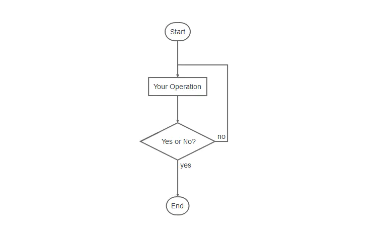

<html>

<head>
<meta http-equiv="Content-Type" content="text/html; charset=gb2312">
<title>新建网页 1</title>
</head>

<body>

<div>
	<div>
		Markdown是一种纯文本格式的标记语言。通过简单的标记语法，它可以使普通文本内容具有一定的格式。<p>相比WYSIWYG编辑器</p>
		<p><strong>优点：</strong><br>
		1、因为是纯文本，所以只要支持Markdown的地方都能获得一样的编辑效果，可以让作者摆脱排版的困扰，专心写作。<br>
		2、操作简单。比如:WYSIWYG编辑时标记个标题，先选中内容，再点击导航栏的标题按钮，选择几级标题。要三个步骤。而Markdown只需要在标题内容前加#即可</p>
		<p><strong>缺点：</strong><br>
		1、需要记一些语法（当然，是很简单。五分钟学会）。<br>
		2、有些平台不支持Markdown编辑模式。</p>
		<p>还好，简书是支持Markdown编辑模式的。</p>
		<pre class="hljs php"><code class="php">开启方式：设置-&gt;默认编辑器-&gt;Markdown编辑器
</code></pre>
		<h1>一、标题</h1>
		<p>在想要设置为标题的文字前面加#来表示<br>
		一个#是一级标题，二个#是二级标题，以此类推。支持六级标题。</p>
		<p>注：标准语法一般在#后跟个空格再写文字，貌似简书不加空格也行。</p>
		<p>示例：</p>
		<pre class="hljs bash"><code class="bash"><span class="hljs-comment"># 这是一级标题</span>
<span class="hljs-comment">## 这是二级标题</span>
<span class="hljs-comment">### 这是三级标题</span>
<span class="hljs-comment">#### 这是四级标题</span>
<span class="hljs-comment">##### 这是五级标题</span>
<span class="hljs-comment">###### 这是六级标题</span>
</code></pre>
		<p>效果如下：</p>
		<h1>这是一级标题</h1>
		<h2>这是二级标题</h2>
		<h3>这是三级标题</h3>
		<h4>这是四级标题</h4>
		<h5>这是五级标题</h5>
		<h6>这是六级标题</h6>
		<hr>
		<h1>二、字体</h1>
		<ul>
			<li>
			<h5>加粗</h5>
			</li>
		</ul>
		<p>要加粗的文字左右分别用两个*号包起来</p>
		<ul>
			<li>
			<h5>斜体</h5>
			</li>
		</ul>
		<p>要倾斜的文字左右分别用一个*号包起来</p>
		<ul>
			<li>
			<h5>斜体加粗</h5>
			</li>
		</ul>
		<p>要倾斜和加粗的文字左右分别用三个*号包起来</p>
		<ul>
			<li>
			<h5>删除线</h5>
			</li>
		</ul>
		<p>要加删除线的文字左右分别用两个~~号包起来</p>
		<p>示例：</p>
		<pre class="hljs undefined"><code>**这是加粗的文字**
*这是倾斜的文字*`
***这是斜体加粗的文字***
~~这是加删除线的文字~~
</code></pre>
		<p>效果如下：</p>
		<p><strong>这是加粗的文字</strong><br>
		<em>这是倾斜的文字</em><br>
		<strong><em>这是斜体加粗的文字</em></strong><br>
		<del>这是加删除线的文字</del></p>
		<hr>
		<h1>三、引用</h1>
		<p>在引用的文字前加&gt;即可。引用也可以嵌套，如加两个&gt;&gt;三个&gt;&gt;&gt;<br>
		n个...<br>
		貌似可以一直加下去，但没神马卵用</p>
		<p>示例：</p>
		<pre class="hljs ruby"><code class="ruby">&gt;这是引用的内容
<span class="hljs-meta">&gt;&gt;</span>这是引用的内容
<span class="hljs-meta">&gt;&gt;</span>&gt;&gt;&gt;&gt;&gt;&gt;&gt;&gt;这是引用的内容
</code></pre>
		<p>效果如下：</p>
		<blockquote>
			<p>这是引用的内容</p>
			<blockquote>
				<p>这是引用的内容</p>
				<blockquote>
					<blockquote>
						<blockquote>
							<blockquote>
								<blockquote>
									<blockquote>
										<blockquote>
											<blockquote>
												<p>这是引用的内容</p>
											</blockquote>
										</blockquote>
									</blockquote>
								</blockquote>
							</blockquote>
						</blockquote>
					</blockquote>
				</blockquote>
			</blockquote>
		</blockquote>
		<h1>四、分割线</h1>
		<p>三个或者三个以上的 - 或者 * 都可以。</p>
		<p>示例：</p>
		<pre class="hljs undefined"><code>---
----
***
*****
</code></pre>
		<p>效果如下：<br>
		可以看到，显示效果是一样的。</p>
		<hr><hr><hr><hr>
		<h1>五、图片</h1>
		<p>语法：</p>
		<pre class="hljs bash"><code class="bash">

图片alt就是显示在图片下面的文字，相当于对图片内容的解释。
图片title是图片的标题，当鼠标移到图片上时显示的内容。title可加可不加
</code></pre>
		<p>示例：</p>
		<pre class="hljs cpp"><code class="cpp">
</code></pre>
		<p>效果如下：</p>
		<br>
　<div class="image-package">
			<div class="image-container" style="max-width: 550px; max-height: 300px; background-color: transparent;">
				<div class="image-container-fill" style="padding-bottom: 54.55%;">
　</div>
				<div class="image-view" data-width="550" data-height="300">
					</div>
			</div>
			<div class="image-caption">
				blockchain</div>
		</div>
		<p><strong>上传本地图片直接点击导航栏的图片标志，选择图片即可</strong></p>
		<p>
		markdown格式追求的是简单、多平台统一。那么图片的存储就是一个问题，需要用图床，提供统一的外链，这样就不用在不同的平台去处理图片的问题了。才能做到书写一次，各处使用。<br>
		关于图床的选择我写了一篇文章，对网上存在的各种方法做了总结，需要的朋友可以看看。<a target="_blank" href="https://www.jianshu.com/p/ea1eb11db63f">markdown图床</a></p>
		<h1>六、超链接</h1>
		<p>语法：</p>
		<pre class="hljs bash"><code class="bash">[超链接名](超链接地址 <span class="hljs-string">&quot;超链接title&quot;</span>)
title可加可不加
</code></pre>
		<p>示例：</p>
		<pre class="hljs cpp"><code class="cpp">[简书](http:<span class="hljs-comment">//jianshu.com)</span>
[百度](http:<span class="hljs-comment">//baidu.com)</span>
</code></pre>
		<p>效果如下：</p>
		<p><a target="_blank" href="https://www.jianshu.com/u/1f5ac0cf6a8b">简书</a><br>
		<a target="_blank" href="https://links.jianshu.com/go?to=http%3A%2F%2Fbaidu.com">
		百度</a></p>
		<p>
		注：Markdown本身语法不支持链接在新页面中打开，貌似简书做了处理，是可以的。别的平台可能就不行了，如果想要在新页面中打开的话可以用html语言的a标签代替。</p>
		<pre class="hljs xml"><code class="xml"><span class="hljs-tag">&lt;<span class="hljs-name">a</span> <span class="hljs-attr">href</span>=<span class="hljs-string">&quot;超链接地址&quot;</span> <span class="hljs-attr">target</span>=<span class="hljs-string">&quot;_blank&quot;</span>&gt;</span>超链接名<span class="hljs-tag">&lt;/<span class="hljs-name">a</span>&gt;</span>

示例
<span class="hljs-tag">&lt;<span class="hljs-name">a</span> <span class="hljs-attr">href</span>=<span class="hljs-string">&quot;https://www.jianshu.com/u/1f5ac0cf6a8b&quot;</span> <span class="hljs-attr">target</span>=<span class="hljs-string">&quot;_blank&quot;</span>&gt;</span>简书<span class="hljs-tag">&lt;/<span class="hljs-name">a</span>&gt;</span>
</code></pre>
		<hr>
		<h1>七、列表</h1>
		<h5>无序列表</h5>
		<p>语法：<br>
		无序列表用 - + * 任何一种都可以</p>
		<pre class="hljs undefined"><code>- 列表内容
+ 列表内容
* 列表内容

注意：- + * 跟内容之间都要有一个空格

</code></pre>
		<p>效果如下：</p>
		<ul>
			<li>列表内容</li>
			<li>列表内容</li>
			<li>列表内容</li>
		</ul>
		<h5>有序列表</h5>
		<p>语法：<br>
		数字加点</p>
		<pre class="hljs undefined"><code>1. 列表内容
2. 列表内容
3. 列表内容

注意：序号跟内容之间要有空格
</code></pre>
		<p>效果如下：</p>
		<ol>
			<li>列表内容</li>
			<li>列表内容</li>
			<li>列表内容</li>
		</ol>
		<h5>列表嵌套</h5>
		<p><strong>上一级和下一级之间敲三个空格即可</strong></p>
		<ul>
			<li>一级无序列表内容<ul>
				<li>二级无序列表内容</li>
				<li>二级无序列表内容</li>
				<li>二级无序列表内容</li>
			</ul>
			</li>
			<li>一级无序列表内容<ol>
				<li>二级有序列表内容</li>
				<li>二级有序列表内容</li>
				<li>二级有序列表内容</li>
			</ol>
			</li>
		</ul>
		<ol>
			<li>一级有序列表内容<ul>
				<li>二级无序列表内容</li>
				<li>二级无序列表内容</li>
				<li>二级无序列表内容</li>
			</ul>
			</li>
			<li>一级有序列表内容<ol>
				<li>二级有序列表内容</li>
				<li>二级有序列表内容</li>
				<li>二级有序列表内容</li>
			</ol>
			</li>
		</ol>
		<hr>
		<h1>八、表格</h1>
		<p>语法：</p>
		<pre class="hljs ruby"><code class="ruby">表头<span class="hljs-params">|表头|</span>表头
---<span class="hljs-params">|:--:|</span>---:
内容<span class="hljs-params">|内容|</span>内容
内容<span class="hljs-params">|内容|</span>内容

第二行分割表头和内容。
- 有一个就行，为了对齐，多加了几个
文字默认居左
-两边加：表示文字居中
-右边加：表示文字居右
注：原生的语法两边都要用 <span class="hljs-params">| 包起来。此处省略
</span></code></pre>
		<p>示例：</p>
		<pre class="hljs ruby"><code class="ruby">姓名<span class="hljs-params">|技能|</span>排行
--<span class="hljs-params">|:--:|</span>--:
刘备<span class="hljs-params">|哭|</span>大哥
关羽<span class="hljs-params">|打|</span>二哥
张飞<span class="hljs-params">|骂|</span>三弟
</code></pre>
		<p>效果如下：</p>
		<table>
			<thead>
				<tr>
					<th>姓名</th>
					<th style="text-align:center">技能</th>
					<th style="text-align:right">排行</th>
				</tr>
			</thead>
			<tr>
				<td>刘备</td>
				<td style="text-align:center">哭</td>
				<td style="text-align:right">大哥</td>
			</tr>
			<tr>
				<td>关羽</td>
				<td style="text-align:center">打</td>
				<td style="text-align:right">二哥</td>
			</tr>
			<tr>
				<td>张飞</td>
				<td style="text-align:center">骂</td>
				<td style="text-align:right">三弟</td>
			</tr>
		</table>
		<h1>九、代码</h1>
		<p>语法：<br>
		单行代码：代码之间分别用一个反引号包起来</p>
		<pre class="hljs javascript"><code class="javascript">    <span class="hljs-string">`代码内容`</span>
</code></pre>
		<p>代码块：代码之间分别用三个反引号包起来，且两边的反引号单独占一行</p>
		<pre class="hljs javascript"><code class="javascript">(<span class="hljs-string">```)
  代码...
  代码...
  代码...
(```</span>)
</code></pre>
		<blockquote>
			<p>注：为了防止转译，前后三个反引号处加了小括号，实际是没有的。这里只是用来演示，实际中去掉两边小括号即可。</p>
		</blockquote>
		<p>示例：</p>
		<p>单行代码</p>
		<pre class="hljs javascript"><code class="javascript"><span class="hljs-string">`create database hero;`</span>
</code></pre>
		<p>代码块</p>
		<pre class="hljs php"><code class="php">(```)
    <span class="hljs-function"><span class="hljs-keyword">function</span> <span class="hljs-title">fun</span><span class="hljs-params">()</span></span>{
         <span class="hljs-keyword">echo</span> <span class="hljs-string">&quot;这是一句非常牛逼的代码&quot;</span>;
    }
    fun();
(```)
</code></pre>
		<p>效果如下：</p>
		<p>单行代码</p>
		<p><code>create database hero;</code></p>
		<p>代码块</p>
		<pre class="hljs php"><code class="php"><span class="hljs-function"><span class="hljs-keyword">function</span> <span class="hljs-title">fun</span><span class="hljs-params">()</span></span>{
  <span class="hljs-keyword">echo</span> <span class="hljs-string">&quot;这是一句非常牛逼的代码&quot;</span>;
}
fun();
</code></pre>
		<h1>十、流程图</h1>
		<pre class="hljs php"><code class="php">```flow
st=&gt;start: 开始
op=&gt;operation: My Operation
cond=&gt;condition: Yes <span class="hljs-keyword">or</span> No?
e=&gt;end
st-&gt;op-&gt;cond
cond(yes)-&gt;e
cond(no)-&gt;op
&amp;```
</code></pre>
		<p>效果如下：<br>
		简书不支持流程图，所以截了个图</p>
		<br>
　<div class="image-package">
			<div class="image-container" style="max-width: 700px; max-height: 467px; background-color: transparent;">
				<div class="image-container-fill" style="padding-bottom: 62.18%;">
　</div>
				<div class="image-view" data-width="751" data-height="467">
					</div>
			</div>
			<div class="image-caption">
				流程图.png</div>
		</div>
	</div>
	<br>
	<br>
</div>

</body>

</html>
